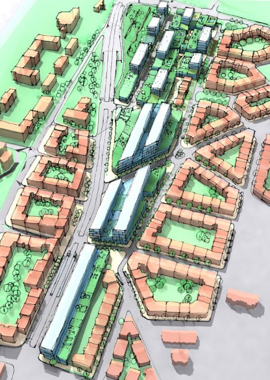

Urban planning is the planning of land use in cities. Urban planning determines how to make the best use of available space. It involves creating land use plans as well as reviewing, approving, modifying, and sometimes rejecting the plans of developers.

Urban and city planners specialize in land use. They create plans and programs for the use of land and public facilities such as schools and libraries in their towns, cities, and counties.

# What Does an Urban Planner Do?

Urban and regional planners develop plans and programs for land use in their jurisdictions. They keep their communities vibrant and healthy by keeping up with population growth; revitalizing, replacing, or repurposing aging infrastructure; adding schools; and making communities more attractive to businesses.

Urban and regional planners work with government officials, developers, and the public to discuss community needs. They gather and analyze data to investigate these needs and develop solutions. Planners use geographic information systems (GIS) to make maps.

Urban and regional planners review, and sometimes solicit plans submitted by developers, and assess them for feasibility, environmental impact, and compliance with zoning and other regulations. They may make modifications to plans, approve them, or deny permits. Some oversee the entire project. They must stay current on zoning or building codes and environmental regulations.

Urban and regional planners may specialize in zoning issues, transportation projects, sustainability and environmental issues, economic development, or public spaces. They design city layouts, streets, and building and landscape patterns.

Urban and regional planners are increasingly involved in sustainable city projects. For example, they may help design parks, greenways, and rain gardens. They may solicit proposals for innovative green technologies such as integrated stormwater and blackwater treatment, LED lighting, solar-powered parking meters and traffic signals, noise barriers with solar panels, or even solar roadways. They may also oversee project implementation.

Planners specializing in zoning issues can adjust zoning to allow higher-density or mixed-use communities. Mixed-use communities combine residential, commercial, office space, and light industry in the same area to facilitate walking and biking, making our lives easier on the planet.

# Where Does an Urban Planner Work?

The vast majority of urban and regional planners work for federal, state, county, and city government agencies. The U.S. Bureau of Labor Statistics (BLS) reported that, as of 2012, most of them (65%) worked in local government. Another 14% provided architectural, engineering, and related services. 10% were employed in state government, and another 7% worked at management, scientific, and technical consulting firms.

Urban and regional planning is vital to the quality of life and economic health of a community, which is partly what makes it a rewarding career. However, its importance also means it's on the radar of political and economic interests, and some can find dealing with their competing needs stressful. Planners also need to manage tight deadlines.

Urban and regional planners must spend time outdoors in the field inspecting land conditions and land use. Most keep typical business hours, though evening and weekend meetings with stakeholders may occasionally be required.

# What Is the Average Urban Planner Salary?

BLS reported the average annual wage for urban and regional planners as $65,230 in May 2012. Those providing architectural, engineering, and related services earned the highest salaries ($71,010). Those working for management, scientific, and technical consulting firms made $67,390. Planners employed by state government earned $64,380, and those working for local government made an average of $63,300.

# What Is the Job Demand for Urban Planners?

Employment of urban and regional planners is projected to grow 10 percent from 2012 to 2022, about as fast as the average for all occupations. Population increases and emphasis on developing "smart cities" with improved sustainability and technology will drive employment growth. However, job opportunities for planners will also depend on economic conditions.

# How Do I Get an Urban Planner Degree?

Urban and regional planners usually need a master's degree from an accredited urban or regional planning program. There are scores of such programs across the U.S. Many master's programs accept students with a wide range of undergraduate backgrounds such as geography, planning, economics, public administration, political science, landscape architecture, and environmental design. There are few undergraduate programs in planning. Undergraduate urban and regional planning courses are typically taught by geography departments. A major in geography also includes related coursework in GIS and environmental issues.

# What Kind of Societies and Professional Organizations Do Urban Planners Have?

- [The American Planning Association (APA)](https://www.planning.org/) is the foremost professional association for planners in the U.S. Its Green Team shares and promotes innovative methods that improve sustainability. It facilitates networking through conferences, events, local chapters, and special interest divisions, including an Environment, Natural Resources and Energy Division. It also has a training service and publishes planning-related publications such as Planning magazine and the Journal of the American Planning Association.
- [The American Institute of Certified Planners (AICP)](https://www.planning.org/aicp/) is the American Planning Association's professional institute. It administers Certified Environmental Planner (AICP CEP) certification and provides leadership through professional ethics, professional development, planning education, and planning standards. It also holds symposiums on a variety of topics.
